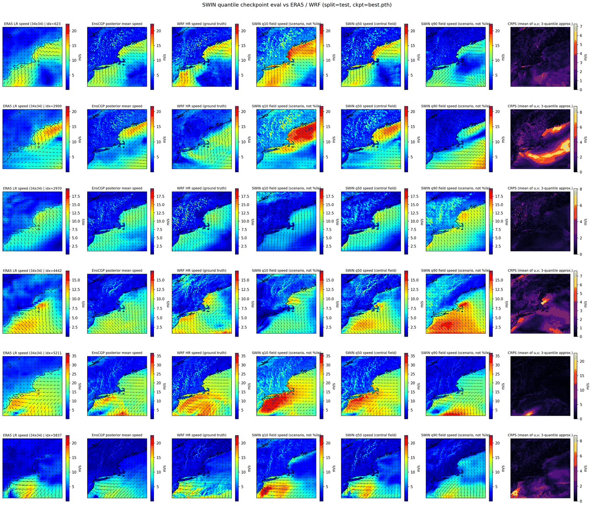
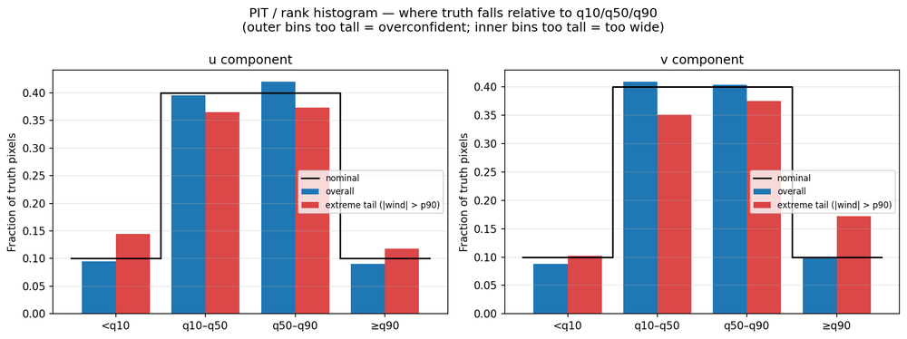

# 26.6_wind

Wind downscaling: an EnsCGP (ensemble-conditional Gaussian process) posterior
first-guess, refined by a Swin2SR transformer that predicts per-pixel quantiles
(q10/q50/q90) of ERA5-to-WRF downscaled wind (u, v), supervised with a
Laplacian-pyramid / sliced-Wasserstein multiscale loss.



*ERA5 input and the EnsCGP first guess (left), WRF truth, and the model's
q10/q50/q90 wind-speed fields. Generated by
`extra_scripts/swin/eval_checkpoint.py`.*

## Results

Held-out test split (1010 samples), `runs/0729_meangate` — the v7 architecture
with `mean_gate` restored. Units are m/s.

| | MAE u | MAE v | CRPS u | CRPS v |
|---|---|---|---|---|
| ERA5 bicubic | 1.880 | 1.925 | — | — |
| EnsCGP posterior mean | 1.799 | 1.882 | — | — |
| EnsCGP/bicubic blend (α=0.5) | 1.690 | 1.754 | — | — |
| **This model (q50)** | **1.728** | **1.821** | **1.147** | **1.205** |

**Read the MAE column with care.** q50 is deliberately *not* trained on a
pointwise error: it is supervised only by the displacement-tolerant structural
losses, because pointwise objectives are minimised by blurring, and a blurred
wind field is the wrong answer even when its MAE is good. The tuned
EnsCGP/bicubic blend beats q50 on MAE while producing a visibly smoother field
and — the substantive point — no uncertainty at all. What the model adds over
any blend is a calibrated envelope:

| Nominal | Empirical coverage (u) | Empirical coverage (v) |
|---|---|---|
| q10 → 0.10 | 0.092 | 0.089 |
| q50 → 0.50 | 0.484 | 0.503 |
| q90 → 0.90 | 0.908 | 0.906 |

Coverage sits within ~1.5 points of nominal at all three levels, and monotonicity
(q10 ≤ q50 ≤ q90) holds by construction rather than by penalty. In the extreme
stratum (top 5% of wind magnitude) the envelope widens as it should — q90
coverage 0.869/0.842 — i.e. it is mildly over-confident exactly where the
problem is hardest, which is the open item rather than a solved one.



*Probability-integral-transform histogram: bin fractions against the nominal
[.10 .40 .40 .10]. Generated by `extra_scripts/swin/eval_quantile_calibration.py`.*

Full head-to-head against the previous architecture, with paired bootstrap CIs,
is in `runs/0729_meangate/figures/scorecard/scorecard_test.csv`
(`extra_scripts/swin/oneoff/eval_model_scorecard.py`). On this split v6-0714 is
still ahead on bulk CRPS/MAE while v7-meangate is ahead on several extreme-stratum
metrics; that trade is not yet settled.

## Layout

```
scripts/              The live pipeline. Flat by design -- modules import each other
                      by bare name. paths.py resolves every path in the repo.
extra_scripts/
  data_prep/          Builds data/ from the upstream wndata.mat + DEM.
  enscgp/             EnsCGP stage: sigma/lambda tuning, neighbor diagnostics,
                      variance recalibration.  graphing/ for its plots.
  swin/               Swin stage. The recurring evals live at this level;
                      _common.py is the shared harness they all use.
    graphing/         Plots (training curves, band decompositions).
    oneoff/           One-time investigations, kept for provenance rather than
                      rerun each version. _v6_0714_arch/ pins the v6 model class.
  presentation/       .pptx generators (they write into runs/<version>/).
runs/<version>/       Everything a run produced:
                        train_*.log        (tracked)
                        checkpoints/*.pth  (gitignored)
                        figures/           (gitignored except *.csv)
                        config.json        (tracked, where present)
data/                 Inputs + derived arrays. Gitignored; see data/README.md.
docs/CHANGELOG.md     Checkpoint-incompatible architecture changes, by version.
docs/figures/         Figures committed deliberately (README illustrations).
```

Only `scripts/` and `extra_scripts/` are code. Everything under `runs/` is
output, so it can be regenerated, blanket-ignored, or deleted without touching
source — which is why the presentation generators live in `extra_scripts/` even
though their `.pptx` output lands in `runs/`.

## Paths

Nothing in this repo hardcodes an absolute path. `scripts/paths.py` is the single
source: it locates the repo from its own file location and exports `REPO`,
`DATA_DIR`, `RUNS_DIR`, `SPLITS_PATH`, plus `resolve()` for config values (which
may be absolute or repo-relative). Scripts outside `scripts/` bootstrap with:

```python
REPO = next(p for p in Path(__file__).resolve().parents
            if (p / "scripts" / "paths.py").is_file())
sys.path.insert(0, str(REPO / "scripts"))
```

That walks *up* rather than counting `.parent` hops, so moving a script between
subdirectories cannot silently break it.

Environment overrides, for pointing the heavy trees at other storage:

| Variable | Default |
|---|---|
| `WIND_DATA_DIR` | `<repo>/data` |
| `WIND_RUNS_DIR` | `<repo>/runs` |
| `WIND_MAT_PATH` | the upstream `wndata.mat` |
| `WIND_DEM_TIF`  | the Copernicus DEM clip |
| `WIND_KEN_ENSCGP_DIR` | unset — only `enscgp/tune_lambda_gcv.py` needs it (see below) |

`python scripts/paths.py` prints every resolved path and whether it exists.

### One external dependency, not bundled

`extra_scripts/enscgp/tune_lambda_gcv.py` calls `select_regularization_gcv` from
the research group's Ens-CGP implementation (Ravela et al., arXiv:2602.13871),
which is not redistributed here. Point `WIND_KEN_ENSCGP_DIR` at a checkout
containing its `utils.py` to run that one script; it exits with instructions
otherwise. **Every other script in this repository runs without it.**

## Running things

Training (see `CLAUDE.md` for the conda env and GPU etiquette):

```bash
cd scripts
python train_new_enscgp_swin.py [--device cuda:N] [--resume PATH] [--max-steps N]
```

The recurring evaluations, pointed at any run's checkpoint:

```bash
cd extra_scripts/swin
python eval_checkpoint.py            --checkpoint ../../runs/<version>/checkpoints/best.pth
python eval_quantile_calibration.py  --checkpoint ...   # PIT histogram + coverage maps
python compare_eigenspectra.py       --checkpoint ...   # spectral fidelity of q50
python eval_pinball_impact.py        --checkpoint ...
python graphing/plot_training_curves.py --log_dir ../../runs/<version>
```

Multi-mode tools take a subcommand: `neighbor_mae.py {rank,mean,sweep-k,baseline}`,
`tune_sigma.py {ssr,mae,decouple}`, `bias_diagnostic.py --part {a,b,c,d,all}`.

## Versioning

**A checkpoint-incompatible change = a git tag.**

```bash
git commit -am "vN: <what broke compatibility>"
git tag vN-<date>
```

`git checkout <tag>` restores the exact model/train/config for that version.
Not every experimental change is tagged — check `git log --oneline` too.

- Current tip is tagged `v7-0729`.
- `archive/pre-reorg-snapshots` holds the original tree including the `0626_v1`
  and `0628_v2` snapshot dirs. Read without checking out:
  `git show archive/pre-reorg-snapshots:scripts/0626_v1/new_enscgp_swin.py`
- `archive/resnet-refiner` — the retired ResNet-refiner line.
- `archive/variance-conditioning` — the retired `variance_conditioning` path.
- **v2 (0627) and v4 (0629) code is not recoverable** — it was overwritten in a
  mutable `scripts/` before git existed. `docs/CHANGELOG.md` describes the diffs, but
  there is no source snapshot. This is the gap git now closes.

Retired binaries (old checkpoints, optuna studies, dead data products) live
outside the repo in `../26.6_wind_archive/`; the code that produced them is
recoverable from the `archive/*` tags above.
